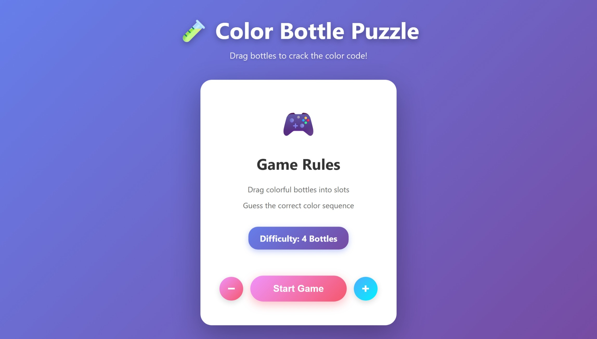
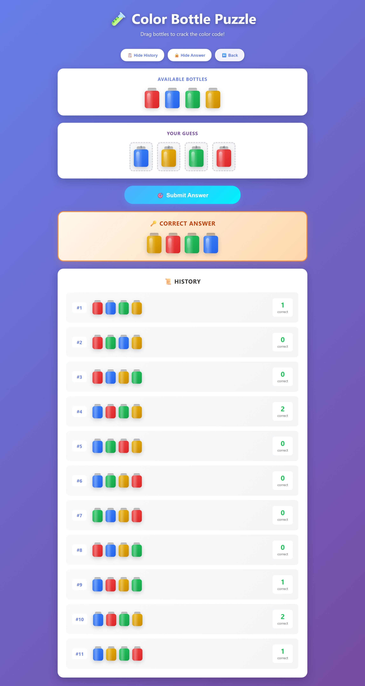

# Color Bottle Puzzle 🧪

A beautiful and interactive React game where players drag and drop colorful bottles to crack the secret color code. Features adjustable difficulty, realistic bottle graphics, and smooth animations for an engaging puzzle experience.

<div align="center">
  
  
  
</div>

---

## ✨ Features

### 🎮 Gameplay
* **Drag & Drop Interface** - Intuitive bottle dragging from pool to slots
* **Flexible Arrangement** - Swap bottles between slots or remove them with a click
* **Smart Feedback** - Shows how many bottles are correctly positioned after each guess
* **Persistent Guesses** - Wrong guesses stay in place so you can adjust instead of starting over
* **Victory Celebration** - Animated trophy and confetti when you crack the code

### 🎯 Difficulty Options
* **Adjustable Challenge** - Choose between 2 to 8 bottles (4 is default)
* **Dynamic Color Pool** - More bottles = more colors to choose from
* **Progressive Difficulty** - Start easy and work your way up

### 📊 Game Management
* **Guess History** - Track all your attempts with visual history
* **Answer Peek** - Toggle to reveal the solution if you're stuck
* **Quick Restart** - Start a new puzzle anytime
* **Clean UI** - Hide/show history to keep your workspace clean

### 🎨 Visual Design
* **Realistic Bottles** - 3D-styled bottles with caps, gradients, and shine effects
* **Smooth Animations** - Hover effects, transitions, and victory animations
* **Modern UI** - Gradient backgrounds, rounded cards, and polished controls
* **Responsive Design** - Works beautifully on desktop and mobile devices

---

## 🚀 Demo

### Start Screen


### Gameplay


---

## 🛠️ Technologies Used

* **React 18+** - Functional components with hooks (useState)
* **Native HTML5 Drag & Drop API** - No external libraries needed
* **CSS3** - Advanced styling with gradients, animations, and transforms
* **Modern JavaScript** - ES6+ features

---

## 📦 Installation

### Prerequisites
- Node.js 14+ and npm/yarn installed

### Steps

1. **Clone the repository:**
```bash
git clone https://github.com/your-username/color-bottle-puzzle.git
cd color-bottle-puzzle
```

2. **Install dependencies:**
```bash
npm install
# or
yarn install
```

3. **Start the development server:**
```bash
npm start
# or
yarn start
```

4. **Open your browser:**
Navigate to `http://localhost:3000`

---

## 🎲 How to Play

1. **Choose Difficulty** - Use the ➕ and ➖ buttons to adjust the number of bottles (2-8)
2. **Start Game** - Click the "Start Game" button
3. **Drag Bottles** - Drag colorful bottles from the pool into the numbered slots
4. **Fill All Slots** - Complete all positions with bottles
5. **Submit Guess** - Click "Submit Answer" to check your solution
6. **Review Feedback** - See how many bottles are in the correct position
7. **Adjust & Retry** - Rearrange bottles or swap them around (they won't disappear!)
8. **Win** - Match all colors correctly to see the victory screen! 🏆

### Tips:
- Click any bottle in a slot to remove it
- Drag bottles between slots to swap positions
- Use "Show Answer" if you're stuck (but where's the fun in that? 😉)
- Check the history to see your previous attempts

---

## 📁 Project Structure

```
src/
├── App.jsx          # Main game component with all logic
├── index.css        # Complete styling including bottle designs
└── index.js         # React entry point
public/
└── index.html       # HTML template
```

### Key Components

**App.jsx** contains:
- Game state management (difficulty, guesses, history)
- Drag & drop logic (start, drop, swap)
- Submit and validation logic
- UI rendering (start screen, game board, history)

**index.css** includes:
- Bottle designs with 3D effects
- Responsive layout
- Animations (fade, bounce, scale)
- Color gradients for all 8 bottle colors

---

## 🎨 Customization

### Change Available Colors
Edit the color arrays in `App.jsx`:
```javascript
const BASE_COLORS = ["red", "blue", "green", "yellow"];
const EXTRA_COLORS = ["purple", "orange", "pink", "cyan"];
```

### Adjust Max Difficulty
Modify the maximum slots in the `addColor` function:
```javascript
if (numSlots >= 8) return; // Change 8 to your desired max
```

### Customize Bottle Styles
Edit bottle colors in `index.css`:
```css
.bottle.red .bottle-body { 
  background: linear-gradient(135deg, #ef4444 0%, #dc2626 100%); 
}
```

### Modify Animations
Adjust animation speeds and effects in `index.css`:
```css
@keyframes bounceIn {
  /* Customize timing and transforms */
}
```

---

## 🎯 Game Rules

- Each color appears exactly once in the solution
- The order matters - red in position 1 is different from red in position 2
- You only see how many are correct, not which ones
- Use deduction and logic to narrow down the possibilities
- No time limit - take your time to think!

---

## 📝 License

This project is licensed under the MIT License - see the [LICENSE](LICENSE) file for details.

---

## 👏 Acknowledgments

- Inspired by youtube bottle games
- Bottle design inspired by laboratory equipment aesthetics
- Built with ❤️ using React

---

## 📧 Contact

Author - [@Ren-Xin-Yu](cultivatetfey@gmail.com)

Project Link: [https://ren-xin-yu.github.io/color-bottle-puzzle/](https://ren-xin-yu.github.io/color-bottle-puzzle/)

---

<div align="center">
  Made with 🧪 and ✨
  <br>
  <sub>Have fun cracking the code!</sub>
</div>